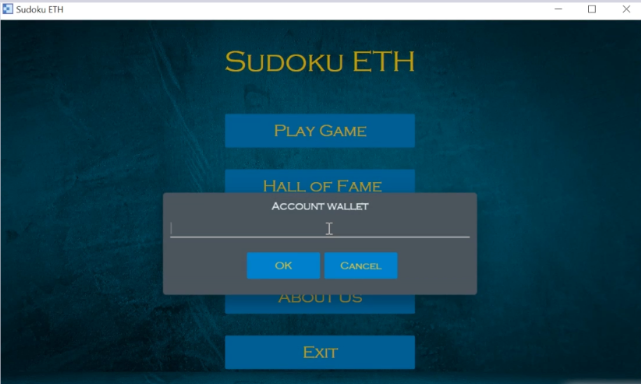
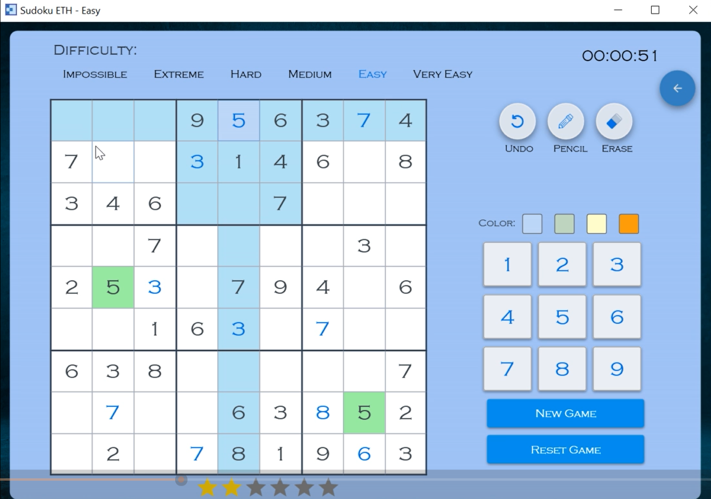

# SudokuETH


## Introduction

SudokuETH is a decentralized Sudoku game that utilizes the Ethereum blockchain for secure and transparent interactions. Players can enjoy solving Sudoku puzzles through an intuitive C# client interface, while game logic and communication are managed by a Python Flask server. The Solidity smart contract, deployed on Remix, handles player accounts, tracks winnings and losses, and ensures fair gameplay.

---
<div style="display: flex; flex-direction: row; align-items: center;">
<!--    -->
  
</div>


---

## Sudoku Functionality and GUI (Client)

The C# client-side interface provides a seamless and immersive gaming experience, allowing players to:

- Initialize new Sudoku boards with varying degrees of difficulty.
- Connect to the Ethereum blockchain to manage player accounts and record winnings and losses.
- Access the Sudoku game board with a 9x9 grid for solving puzzles.
- Input digits from 1 to 9 into empty cells to fill the Sudoku grid.
- Verify moves for correctness and provide feedback on incorrect entries.


## Smart Contract (Solidity)

The Solidity smart contract serves as the heart of SudokuETH. It is responsible for the following functionalities:

- Initializing player accounts, tracking game history, and maintaining scores.
- Handling Sudoku board state and verifying player moves for accuracy.
- Transferring coins to player accounts for successful puzzle completions.
- Collecting coins from player accounts for unsuccessful puzzle attempts.
- Ensuring fair and tamper-proof gameplay on the Ethereum blockchain.

## Backend Server (Python Flask)

The Python Flask backend server acts as the intermediary between the C# client interface and the Ethereum blockchain. It handles the following tasks:

- Running the smart contract functions using web3.py to interact with the Ethereum network.
- Managing player account transactions and updating scores and game history.
- Providing real-time updates and game feedback to the client interface.
- Authenticating players and managing session data.

## Technologies Used

SudokuETH is built using the following technologies:

- C#: Provides the client-side interface and user interactions for Sudoku functionality.
- Solidity: Implements the smart contract logic for Ethereum blockchain integration.
- Remix: Used for deploying and testing the smart contract on the Ethereum network.
- Python Flask: Manages game logic and communication between client and smart contract using web3.py.
- Web3.py: Enables communication with the Ethereum blockchain from the Flask server.

## Installation and Setup

To set up SudokuETH on your local machine, follow these steps:

1. Clone the repository:
   ```
   git clone <repository-url>
   ```

2. Set up the C# client interface using your preferred C# IDE for Sudoku functionality.

3. Deploy the smart contract on the Remix IDE or any Ethereum development network like Ganache.

4. Install Python and Flask on your system.

5. Install the required Python dependencies for the Flask server:
   ```
   cd SudokuETH/Python_S_Contract
   pip install -r requirements.txt
   ```

## Running the Application

To run SudokuETH, follow these steps:

1. Start the Flask server:
   ```
   cd SudokuETH/Python_S_Contract
   python app.py
   ```

2. Launch the C# client-side interface from your C# IDE.

3. Connect the client interface to the deployed smart contract address on the Ethereum network.

4. Open / Create the `.env ` file and provide the necessary configuration values

5. Start playing Sudoku on the C# client interface!

## Contributing

We welcome contributions to SudokuETH. If you find any issues or have ideas for improvements, please open an issue or submit a pull request on the repository.
